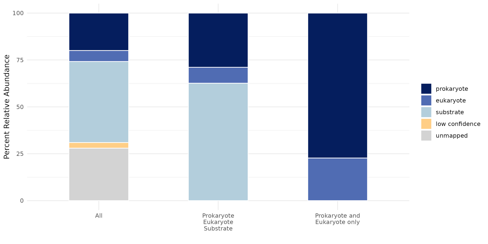
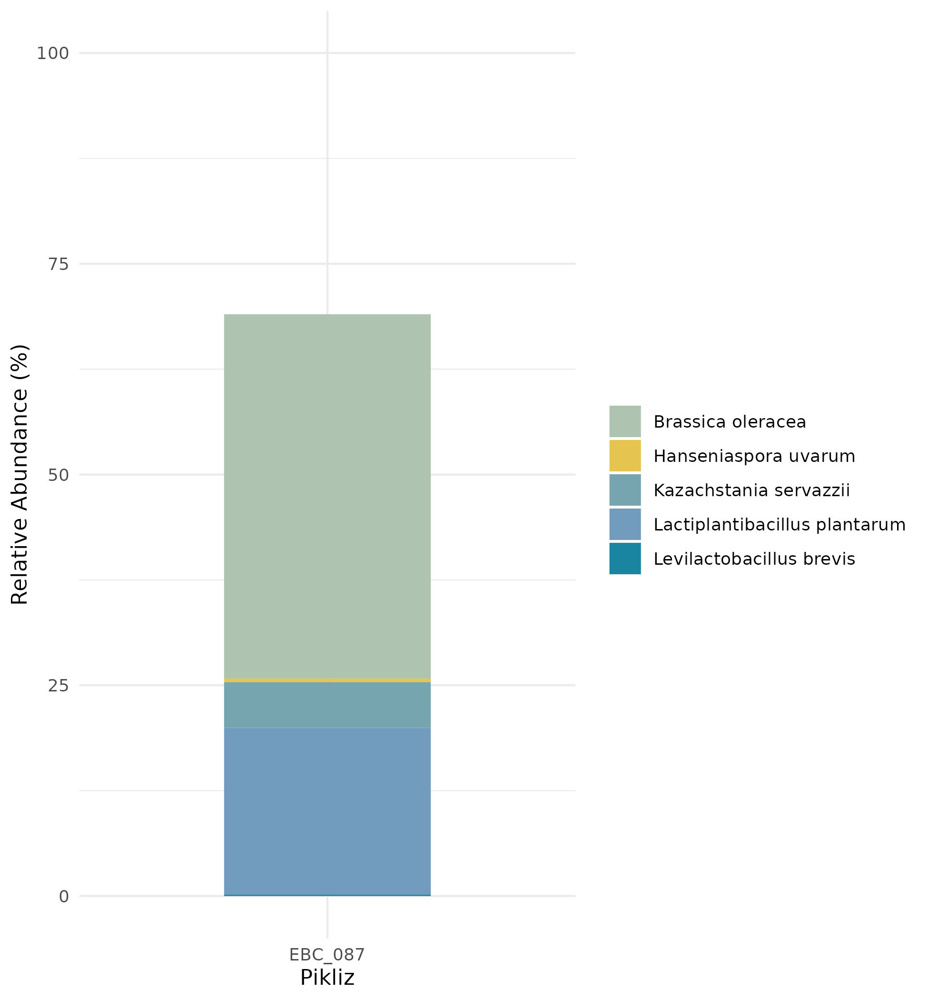

Example Output
===================

Now that you have completed your alignment based profiling using MiFoDB, we can calculate the mapping abundance. 

*Set up table:*

**1.** Your inStrain profile results

.. csv-table:: Example: EBC_177.IS_genome_info.csv

   genome,coverage,breadth,nucl_diversity,length,true_scaffolds,detected_scaffolds,coverage_median,coverage_std,coverage_SEM,breadth_minCov,breadth_expected,nucl_diversity_rarefied,conANI_reference,popANI_reference,iRep,iRep_GC_corrected,linked_SNV_count,SNV_distance_mean,r2_mean,d_prime_mean,consensus_divergent_sites,population_divergent_sites,SNS_count,SNV_count,filtered_read_pair_count,reads_unfiltered_pairs,reads_mean_PID,reads_unfiltered_reads,divergent_site_count
    C-03.Ssa-BR.fna,1.686020547,0.049164091,0.004595774,1896140,182,86,0,69.19478668,0.050739639,0.011300326,0.774346839,0.000140703,0.986372334,0.988145797,,FALSE,242,39.69008264,0.951699521,0.999845137,292,254,252,165,15171,15417,0.981642137,36199,417
 EBC_086.5.fna,1.596317454,0.049848898,0.006035971,2377866,79,52,0,19.94120243,0.012974942,0.028909535,0.755746415,0.002048653,0.979081506,0.984682077,,FALSE,1337,56.69334331,0.637899652,0.9941014,1438,1053,1040,825,17829,19210,0.969968582,48221,1865

**2.** Sample read info, found in bowtie2.log file created after making the .bam file. For each bowtie2.log, save the sample name and paired reads (bolded below) (this will be the read_pairs after adapter trimming and human genome remover)

::

    $ inStrain -h

                    ...::: inStrain v1.3.2 :::...

      Matt Olm and Alex Crits-Christoph. MIT License. Banfield Lab, UC Berkeley. 2019

      Choose one of the operations below for more detailed help. See https://instrain.readthedocs.io for documentation.
      Example: inStrain profile -h

      Workflows:
        profile         -> Create an inStrain profile (microdiversity analysis) from a mapping.
        compare         -> Compare multiple inStrain profiles (popANI, coverage_overlap, etc.)

      Single operations:
        profile_genes   -> Calculate gene-level metrics on an inStrain profile [DEPRECATED; USE profile INSTEAD]
        genome_wide     -> Calculate genome-level metrics on an inStrain profile
        quick_profile   -> Quickly calculate coverage and breadth of a mapping using coverM
        filter_reads    -> Commands related to filtering reads from .bam files
        plot            -> Make figures from the results of "profile" or "compare"
        other           -> Other miscellaneous operations

18233183 reads; of these:
  **18233183** (100.00%) were paired; of these:
    16282298 (89.30%) aligned concordantly 0 times
    1046019 (5.74%) aligned concordantly exactly 1 time
    904866 (4.96%) aligned concordantly >1 times
    ----
    16282298 pairs aligned concordantly 0 times; of these:
      520393 (3.20%) aligned discordantly 1 time
    ----
    15761905 pairs aligned 0 times concordantly or discordantly; of these:

**3.** Database mapping file `MiFoDB_beta_v2_allRef <https://zenodo.org/records/10811087>`_

*Calculate relative abundance:*

**1.** Join the IS_genome_info.csv file to sample read info and sample mapping information.

``percent_abundance = ((filtered_read_pair_count)/read_pairs)*100))``

Where filtered_read_pair_count is originally in the .IS_genome_info.csv, and read_pairs is from bowtie2.log

**2.** For QC, filter any genomes with breadth < 0.5. Those can be considered "low confidence" mapping, while any genomes with breadth > 0.5 are considered high-confidence mapping results.

You can then combine all results from MiFoDB_prok, MiFoDB_euk, and MiFoDB_sub.

For an additional QC with MiFoDB_sub, remove any genome with abundance <2%.

**3.** Results are now ready for plotting and downstream analysis. For example:

Or take a closer look at the mapped species:

