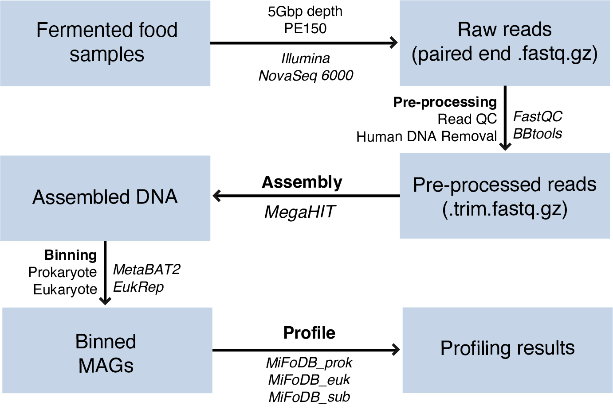

Overview
===================

The MiFoDB Workflow
+++++++++++++++++++++++++++++++++++++++++++++++++++++++++++++++++++++

*The above figure shows a visual representation of the MiFoDB workflow, including pre-processing, assembly, binning, and alignment-based profiling.*

Glossary & FAQ
+++++++++++++++++++++++++++++++++++++++++++++++++++++++++++++++++++++

Glossary of terms used in MiFoDB
------------------------------------

.. note::
  This glossary is meant to give a conceptual overview of the terms used in MiFoDB. For a more detailed overview of these concepts, see the `InStrain Glossary <https://instrain.readthedocs.io/en/latest/overview.html#glossary-faq>`_.

.. glossary::
ANI
  Average nucleotide identity

scaffold-to-bin file
  A .txt file with two columns where the first column is the scaffold name and the second column is the name of the genome the scaffold belongs to.
  Can be created using the script `parse_stb.py <https://github.com/MrOlm/drep/blob/master/helper_scripts/parse_stb.py>`_ that comes with the program
  ``dRep``  See :doc:`example_output` for more info

FAQ
------------------------------------
*Why use alignment-based profiling?*
+++++++++++++++++++++++++++++++++++++++++++++++++++++++++++++++++++++
There are three main methods currently used for metagenome profiling, each with advantages and disadvantages.

**1. Marker based** 
Marker based methods (i.e. MetaPhlan4) make use of gene markers identified for a vast number of reference genomes to quickly profile metagenomic samples. These methods are some of the most common, and show high accuracy for specific markers. However, based on the number of markers identified for each genome in the sample, might result in poor ientification of genomes, leading to higher false-positive rates. In addition, a marker-based method only allows for the identification of genomes with established markers, not allowing for  novel genome identification. In addition, data is generally reported as relative abundance on mapped genomes, which does not present a clear picture of how many genomes is the sample remain unknown.

**2. K-mer based** 
K-mer based methods (i.e. Clark, Kraken, Kaiju) use short exact matching substrings of fixed-length k in a genome or protein sequence, and map them to a reference database of genome or protein sequence indexes identified from a dataset. This method is very fast, but can lead to lower profiling accuracy at lower taxonomic lengths (share larger k-mer regions). These might result in higher-false positive rates. In addition, 

**3. Alignment based** 
Alignment based methods (i.e. InStrain) use a database to directly match sample reads to a genome reference database, while taking SNPs into account. While this results in high-accuracy and low false-positive rates, this method is more computationally intensive than marker based and k-mer based methods. However, reults from aligmnet based profiling can be easily used for functional analysis, strain tracking, and gene profiling. In addition, reporting of unmapped and low quality reads give a clear picture of how much of the sample is accurately profiled, and allows for the identification of novel genomes. For more information about inStrain, check out the Important concepts on the `inStrain page <https://instrain.readthedocs.io/en/latest/important_concepts.html>`_.

*What an I do with MiFoDB results?*
+++++++++++++++++++++++++++++++++++++++++++++++++++++++++++++++++++++
MiFoDB are incorporated into the  `inStrain workflow. 

*Why do I not have <100% samples mapped?*
+++++++++++++++++++++++++++++++++++++++++++++++++++++++++++++++++++++
