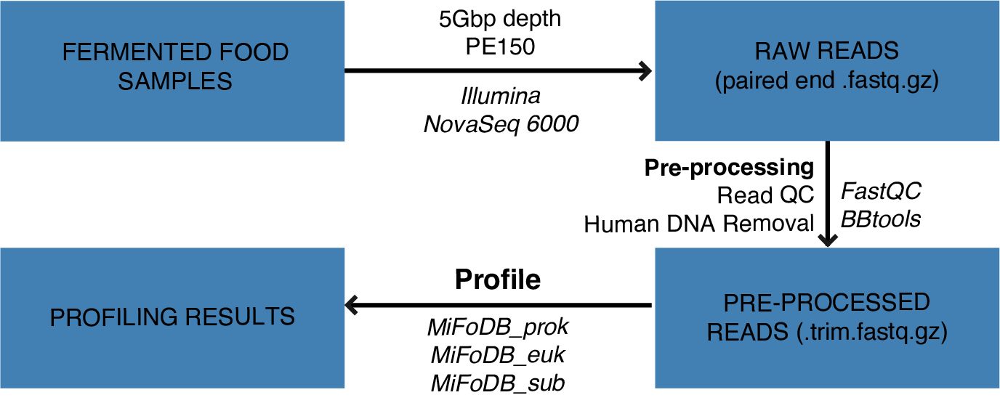

Overview
===================

The MiFoDB Workflow
+++++++++++++++++++++++++++++++++++++++++++++++++++++++++++++++++++++

A visual representation of the MiFoDB workflow, including pre-processing and alignment-based profiling. For additional uses and examples, see `advanced use <https://mifodb.readthedocs.io/en/latest/advanced_use.html>`_.

FAQ
------------------------------------
*Why use alignment-based profiling?*
+++++++++++++++++++++++++++++++++++++++++++++++++++++++++++++++++++++
There are three main methods currently used for metagenome profiling, each with advantages and disadvantages.

**1. Marker based** 

Marker based methods (i.e. MetaPhlan4) make use of gene markers identified for a vast number of reference genomes to quickly profile metagenomic samples. These methods are some of the most common, and show high accuracy for specific markers. However, based on the number of markers identified for each genome in the sample, might result in poor ientification of genomes, leading to higher false-positive rates. In addition, a marker-based method only allows for the identification of genomes with established markers, not allowing for  novel genome identification. In addition, data is generally reported as relative abundance on mapped genomes, which does not present a clear picture of how many genomes is the sample remain unknown.

**2. K-mer based** 

K-mer based methods (i.e. Clark, Kraken, Kaiju) use short exact matching substrings of fixed-length k in a genome or protein sequence, and map them to a reference database of genome or protein sequence indexes identified from a dataset. This method is very fast, but can lead to lower profiling accuracy at lower taxonomic lengths (share larger k-mer regions). These might result in higher-false positive rates. In addition, 

**3. Alignment based** 

Alignment based methods (i.e. InStrain) use a database to directly match sample reads to a genome reference database, while taking SNPs into account. While this results in high-accuracy and low false-positive rates, this method is more computationally intensive than marker based and k-mer based methods. However, reults from aligmnet based profiling can be easily used for functional analysis, strain tracking, and gene profiling. In addition, reporting of unmapped and low quality reads give a clear picture of how much of the sample is accurately profiled, and allows for the identification of novel genomes. For more information about inStrain, see inStrain `Important Concepts <https://instrain.readthedocs.io/en/latest/important_concepts.html>`_ page.

*Which microbes are included in MiFoDB?*
+++++++++++++++++++++++++++++++++++++++++++++++++++++++++++++++++++++
MiFoDB is designed as a tri-partite system to allow for maximum genome coverage while also allowing for domain-specific downstream analysis (for example, gene calling methods that differ btween prokaryotes and eukaryotes).

MiFoDB design included use of dRep, which compared input genomes to include only representative genomes for each species based on completeness, contamination, and ANI >95%. Because of this, certain input genomes which might have undergone reclassification, renaming, or did not pass QC parameters might not appear in the final database. We recommend checking both the `input <https://docs.google.com/spreadsheets/d/1MRm0-iEqrncYY2IdW30ywDP2KTAJqAycLmWepbkV_H8/edit?usp=sharing>`_ and `final genome list <https://docs.google.com/spreadsheets/d/1PHRlb9YwKiwpVk8ChozBZbFYCA-VL3EXJTIPI-TI04A/edit#gid=815330257>`_ to identify whether a genome is included or whether a better representative genome was selected for the final database.

*What can I do with MiFoDB results?*
+++++++++++++++++++++++++++++++++++++++++++++++++++++++++++++++++++++
Downstream uses for MiFoDB results include:

* **Strain tracking:** using instrain compare, in an unbiased manner we can identify detailed, accurate, microdiversity-aware strains that are shared between samples. Strain identification is based on 99.999% popANI and ≥50% percent_genome_compared, which are dependant on the instrain profile run. For more infomation, see see inStrain `Important Concepts <https://instrain.readthedocs.io/en/latest/important_concepts.html>`_.

* **Gene-based annotation:** Results can be easily used for functional analyses, including gene annotations based on `KEGG Orthologies <https://www.genome.jp/tools/kofamkoala/>`_, `Carbohydrate-Active enZYmes (CAZymes) <http://www.cazy.org/>`_, `Pfam <http://pfam.xfam.org/>`_, and `antibiotic resistant genes <https://card.mcmaster.ca/download>`_. 

*Why do I not have <100% samples mapped?*
+++++++++++++++++++++++++++++++++++++++++++++++++++++++++++++++++++++
MiFoDB allows for the calculation of mapped reads compared to the total trimmed reads, allowing for the reporting of both mapped and unmapped reads. 

**What are the unmapped reads?** 

Because we use a reference database, unmapped reads might include genomes not in the database, poor quality genomes, or poorly assembled genomes. Considering the typically lower absolute mapping success of complex soil microbiome, and high abundance of well studied infant gut microbiome samples, fermented food sample mapping reflects an expected middle ground in diversity, being less diverse than the soil, but underexplored compared to the gut microbiome. 

**How can I increase my mapped genome abundance?**
There are a few methods to help increase the percentage of mapped genomes:

**1. Add more genomes to MiFoDB**: Fermented food metagenomics has yet to account for the diversity of microbes in ferments. One simple way is to use simple profiling methods to identify potential genomes of interest, and then add their reference genomes to the core MiFoDB database. Instructions on how to do that is `included here <https://mifodb.readthedocs.io/en/latest/advanced_use.html#identifying-and-adding-prokaryote-genomes>`_. 

**2. Deeper sequencing for discovery of novel genomes**: While we incorporate a majority of reference genomes into our database, a number of newly assembled and binned MAGs were also identified. There are likely a number of novel microbial genomes in fermented foods. However, due to lower sequencing depth, might meet coverage requirements for assembly. Performing deeper sequencing (>5Gb/sample), would allow for higher coverage and breadth of understudied genomes, allowing for further novel MAG identification.

